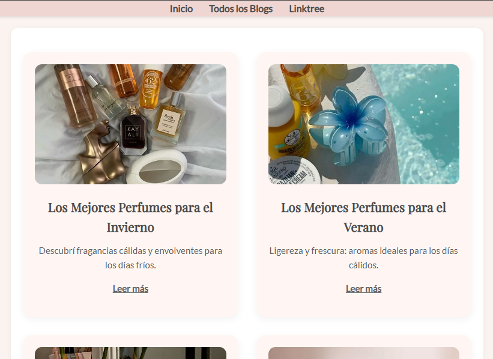

# Portafolio Web – Ana Victoria Lubari

¡Hola! 👋 Soy Ana Victoria Lubari, estudiante de Desarrollo de Software en UADE. Este es mi portafolio personal donde muestro algunos de mis proyectos, conocimientos y vías de contacto.

🔗 **Sitio en línea:**  
[https://lubari.github.io/tpporfolio/index.html](https://lubari.github.io/tpporfolio/index.html)

## 🌟 Tecnologías utilizadas

- **HTML5**
- **CSS3**
- **JavaScript**
- [EmailJS](https://www.emailjs.com/) – para el formulario de contacto
- Fuentes de Google Fonts (Raleway)

## 📁 Estructura del proyecto

```
tpporfolio/
│
├── index.html                 # Página principal del portfolio
├── index.css                  # Estilos generales
├── imagenes/                  # Imágenes del sitio (logos, capturas, etc.)
├── galeria/                   # Proyecto: Galería de imágenes
├── todolist/                  # Proyecto: To Do List
└── ... otros archivos
```

## 🧩 Secciones del portfolio

- **Inicio**: Presentación e introducción
- **Proyectos**: Lista de proyectos con capturas y enlaces
- **Sobre mí**: Breve resumen profesional
- **Contacto**: Formulario funcional que envía correos usando EmailJS

## 📬 Envío de mensajes

El formulario de contacto usa EmailJS para enviar correos.  
Si quieres usar esta funcionalidad en tu propio proyecto:

1. Crear una cuenta en [EmailJS](https://emailjs.com)
2. Crear un _Service ID_ y _Template ID_
3. Obtener tu **clave pública**
4. Incluir el script de EmailJS en tu HTML:
   ```html
   <script src="https://cdn.emailjs.com/dist/email.min.js"></script>
   ```
5. Inicializarlo:
   ```js
   emailjs.init("public_tuClavePublica");
   ```

## 🚀 Cómo clonar el proyecto

```bash
git clone https://github.com/lubari/tpporfolio.git
cd tpporfolio
```

Luego simplemente abre `index.html` en tu navegador.

## 📸 Vista previa



## 📞 Contacto

- [LinkedIn](https://www.linkedin.com/in/ana-victoria-lubari/)
- [GitHub](https://github.com/lubari)

---

© 2025 Ana Victoria Lubari. Todos los derechos reservados.
